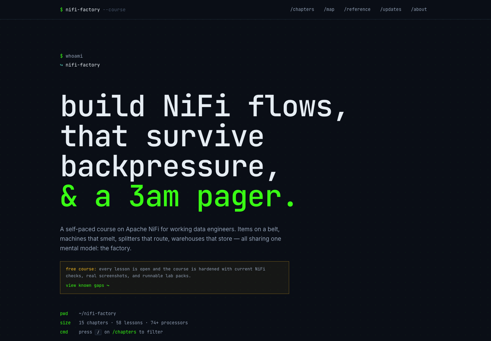
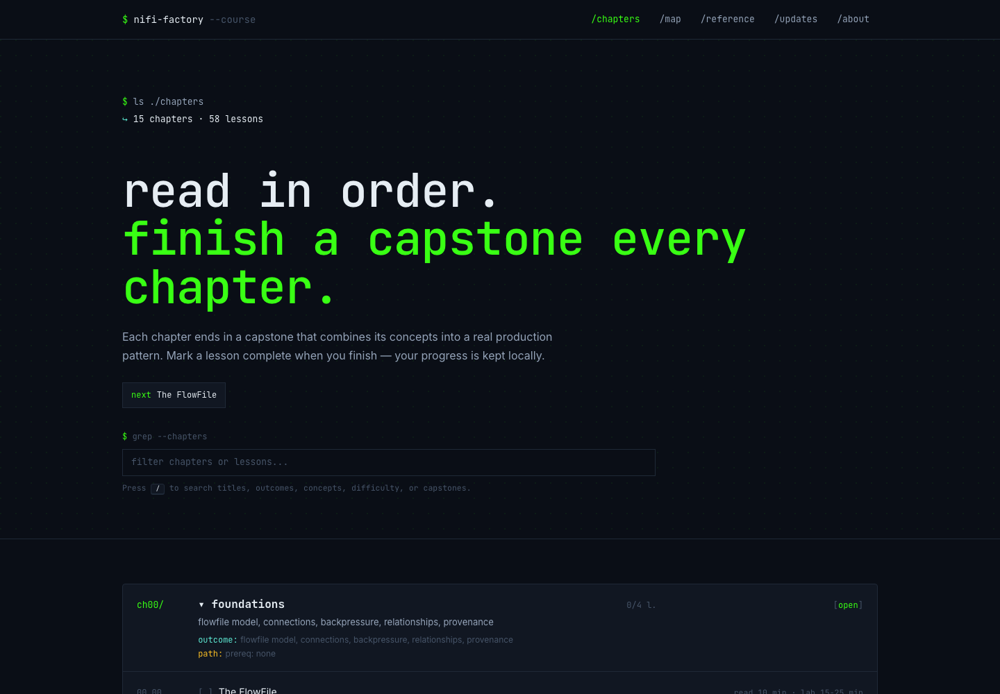
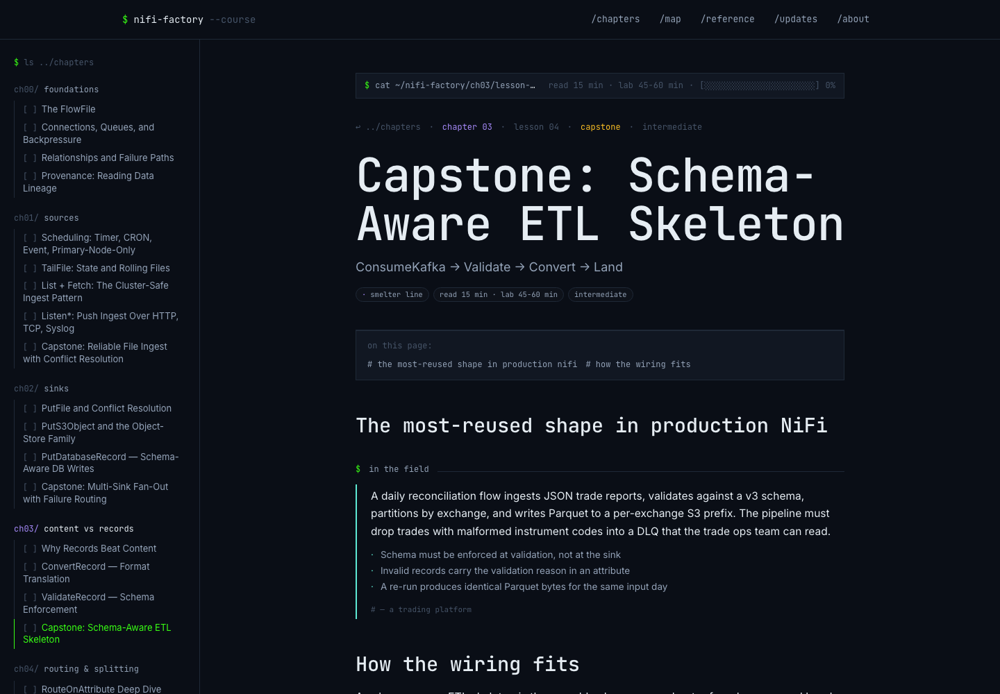
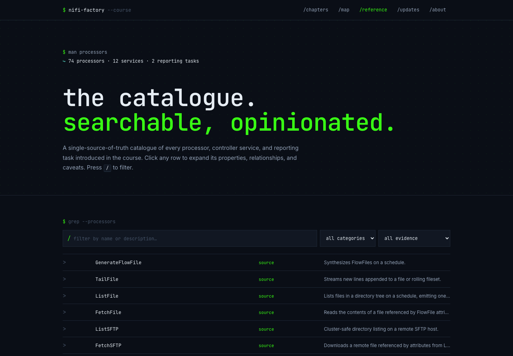

# NiFi Factory

Free Apache NiFi course for data engineers who want practical flow patterns, public labs, and examples they can check against expected output.

[Start the course on the official site](https://nififactory.com/)

## How It Works

NiFi Factory teaches Apache NiFi through 15 focused chapters and 58 lessons. Each chapter explains a data-flow pattern, shows the processor and relationship choices that matter, then ends with a lab and expected output you can compare against.

The course is self-paced: read the pattern, inspect the flow, run the public lab files, and compare your output with the rubric.

## Screenshots And Proof Points

| Surface | What it shows |
| --- | --- |
|  | 15 chapter course map with 58 public lessons. |
|  | Record-oriented capstone material with setup, wiring, expected outputs, and review criteria. |
|  | Processor reference with source links for quick lookup while designing flows. |

## Product Facts

- Official site: [nififactory.com](https://nififactory.com/)
- Format: free, self-paced Apache NiFi course
- Scope: foundations, records, routing, sources, sinks, APIs, Kafka, reliability, platform operations, and security
- Includes: public labs, capstone rubrics, generated teaching diagrams, and processor reference material

## Source Boundary

This repo is the public GitHub landing page for the official site. It contains only static promo files and public screenshots; no source code is published here.
